# **Программное средство автоматизация исхоящего и входящего перестрахования**

Цель проекта — автоматизировать процессы перестрахования. Система предоставляет удобный интерфейс для клиентов, страховой компании и администраторов, а также реализует безопасность и авторизацию пользователей.

**Сервер**: [https://github.com/alex-bobrik/BobrikAV_214371_RIOPK_Server](https://github.com/alex-bobrik/BobrikAV_214371_RIOPK_Server)  
**Клиент**: [https://github.com/alex-bobrik/BobrikAV_214371_RIOPK_Client](https://github.com/alex-bobrik/BobrikAV_214371_RIOPK_Client)

---

## **Содержание**

1. [Архитектура](#архитектура)
2. [Функциональные возможности](#функциональные-возможности)
3. [Детали реализации](#детали-реализации)
4. [Тестирование](#тестирование)
5. [Установка и запуск](#установка-и-запуск)
6. [Лицензия](#лицензия)
7. [Контакты](#контакты)

---

## **Архитектура**

### C4-модель

#### Контекстный уровень
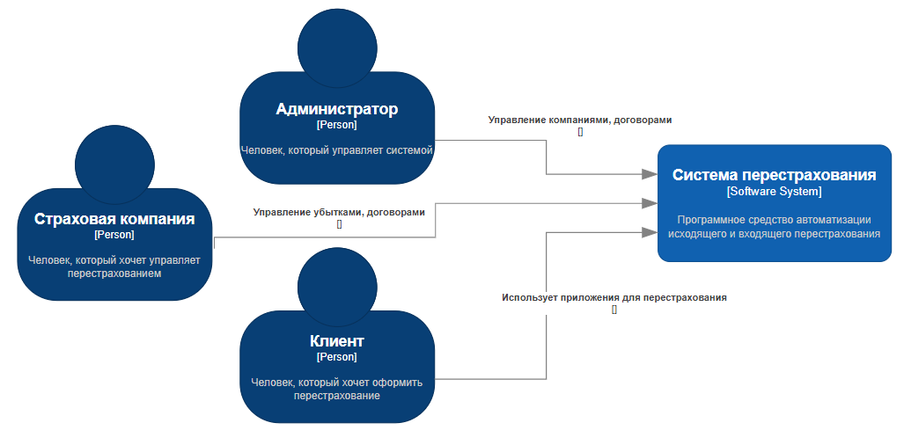

#### Контейнерный уровень
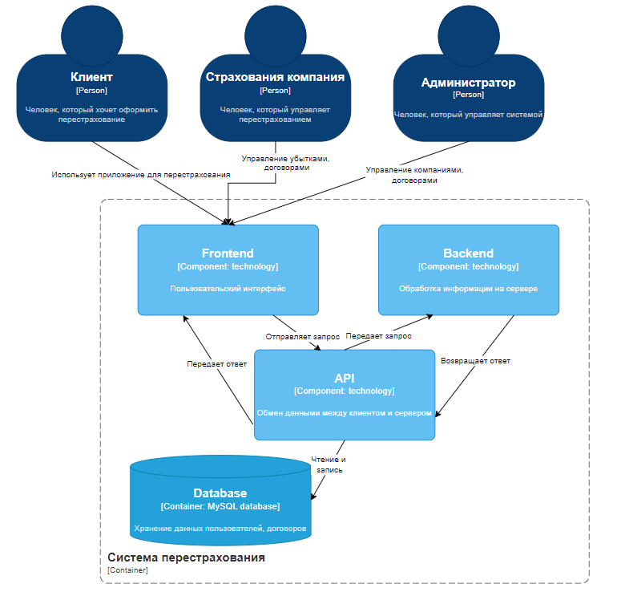

#### Компонентный уровень
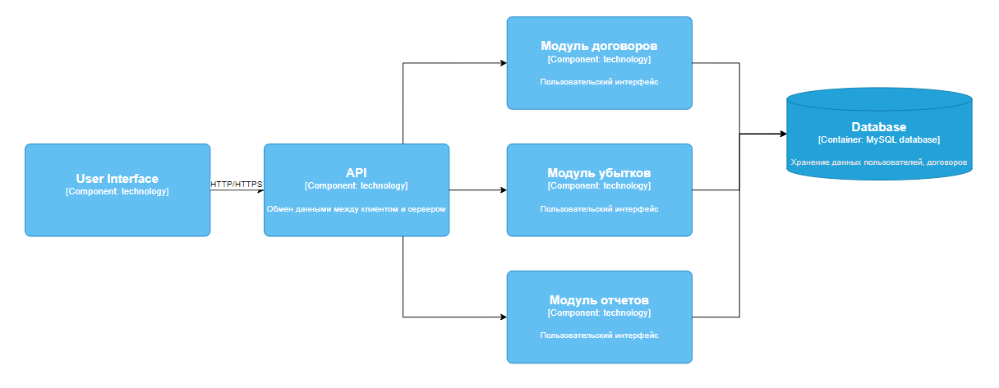

#### Кодовый уровень
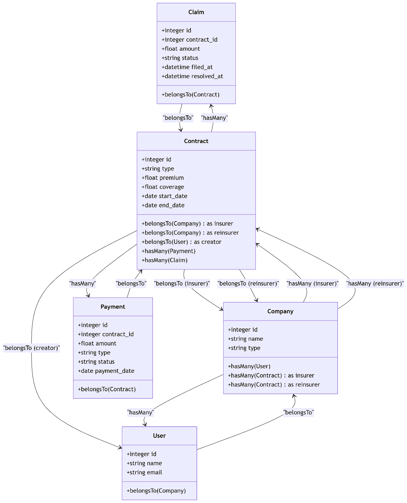

### Схема данных
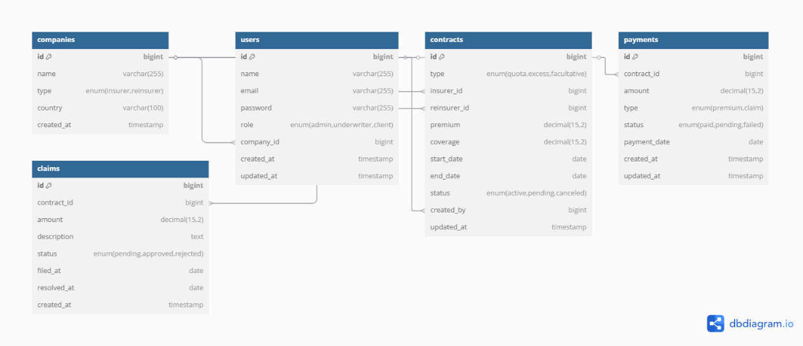

```sql
-- SQL-скрипт для создания базы данных
CREATE TABLE companies (
    id BIGINT AUTO_INCREMENT PRIMARY KEY,
    name VARCHAR(255) NOT NULL,
    type ENUM('insurer', 'reinsurer') NOT NULL,
    country VARCHAR(100) NOT NULL,
    created_at TIMESTAMP DEFAULT CURRENT_TIMESTAMP
);

CREATE TABLE users (
    id BIGINT AUTO_INCREMENT PRIMARY KEY,
    name VARCHAR(255) NOT NULL,
    email VARCHAR(255) UNIQUE NOT NULL,
    password VARCHAR(255) NOT NULL,
    role ENUM('admin', 'underwriter', 'client') NOT NULL,
    company_id BIGINT,
    created_at TIMESTAMP DEFAULT CURRENT_TIMESTAMP,
    updated_at TIMESTAMP DEFAULT CURRENT_TIMESTAMP ON UPDATE CURRENT_TIMESTAMP,
    FOREIGN KEY (company_id) REFERENCES companies(id)
);

CREATE TABLE contracts (
    id BIGINT AUTO_INCREMENT PRIMARY KEY,
    type ENUM('quota', 'excess', 'facultative') NOT NULL,
    insurer_id BIGINT NOT NULL,
    reinsurer_id BIGINT NOT NULL,
    premium DECIMAL(15,2) NOT NULL,
    coverage DECIMAL(15,2) NOT NULL,
    start_date DATE NOT NULL,
    end_date DATE NOT NULL,
    status ENUM('active', 'pending', 'canceled') NOT NULL,
    created_by BIGINT NOT NULL,
    updated_at TIMESTAMP DEFAULT CURRENT_TIMESTAMP ON UPDATE CURRENT_TIMESTAMP,
    FOREIGN KEY (insurer_id) REFERENCES companies(id),
    FOREIGN KEY (reinsurer_id) REFERENCES companies(id),
    FOREIGN KEY (created_by) REFERENCES users(id)
);

CREATE TABLE payments (
    id BIGINT AUTO_INCREMENT PRIMARY KEY,
    contract_id BIGINT NOT NULL,
    amount DECIMAL(15,2) NOT NULL,
    type ENUM('premium', 'claim') NOT NULL,
    status ENUM('paid', 'pending', 'failed') NOT NULL,
    payment_date DATE NOT NULL,
    created_at TIMESTAMP DEFAULT CURRENT_TIMESTAMP,
    updated_at TIMESTAMP DEFAULT CURRENT_TIMESTAMP ON UPDATE CURRENT_TIMESTAMP,
    FOREIGN KEY (contract_id) REFERENCES contracts(id)
);

CREATE TABLE claims (
    id BIGINT AUTO_INCREMENT PRIMARY KEY,
    contract_id BIGINT NOT NULL,
    amount DECIMAL(15,2) NOT NULL,
    description TEXT,
    status ENUM('pending', 'approved', 'rejected') NOT NULL,
    filed_at DATE NOT NULL,
    resolved_at DATE,
    created_at TIMESTAMP DEFAULT CURRENT_TIMESTAMP,
    FOREIGN KEY (contract_id) REFERENCES contracts(id)
);
```

---

## **Функциональные возможности**

### Диаграмма вариантов использования
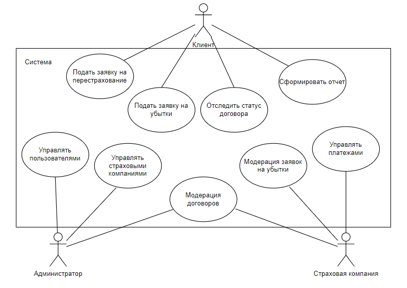

### User-flow диаграмма

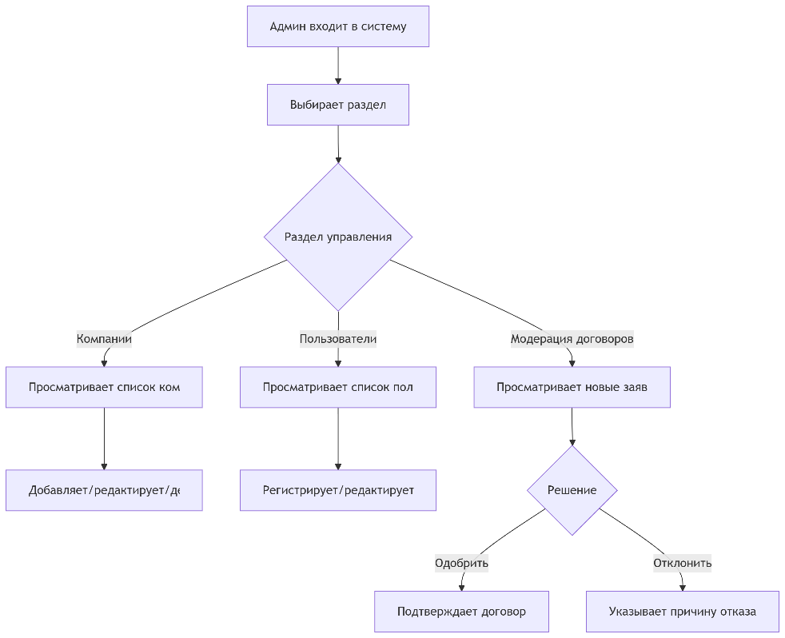


---

## **Детали реализации**

### UML-диаграммы

#### Диаграмма классов
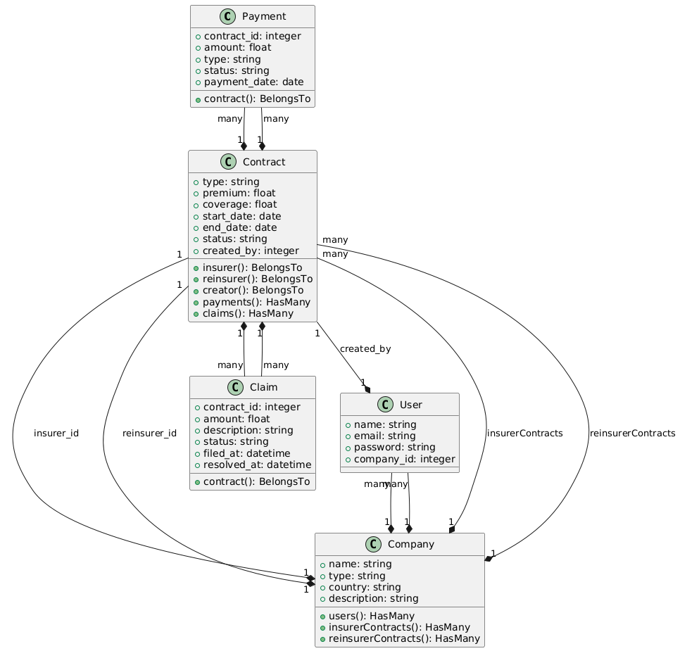

#### Диаграмма последовательностей


#### Диаграмма компонентов
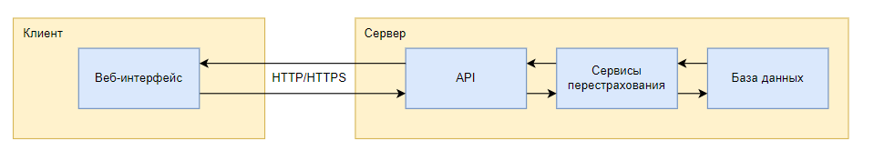

### Спецификация API

Открыть в браузере:  
[http://127.0.0.1:8000/docs](http://127.0.0.1:8000/docs)

OpenAPI файл `openapi.json` генерируется автоматически.

### Безопасность

Использована JWT-аутентификация:
```php
function create_access_token(array $data, ?DateTimeInterface $expiresDelta = null): string
{
    $now = Carbon::now();
    $expire = $expiresDelta 
        ? $now->copy()->add($expiresDelta) 
        : $now->copy()->addMinutes(config('jwt.access_token_expire'));
    
    $payload = array_merge($data, [
        'exp' => $expire->timestamp,
        'iat' => $now->timestamp,
    ]);
    
    return JWT::encode($payload, config('jwt.secret'), config('jwt.algorithm'));
}
```

### Оценка качества кода

Анализ с использованием `PHPStan`, `PHP_CodeSniffer` и `PHPMD`:
- Cyclomatic Complexity (PHPMD): нормальный уровень
- Ошибки статики (`PHPStan`): отсутствуют
- Code Rating (`PHP_CodeSniffer`): > 8.0

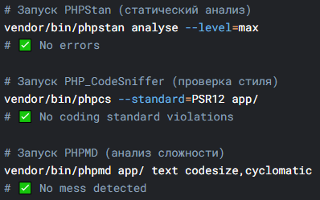

---

## **Тестирование**

### Unit-тесты

Покрытие:
- Проверка хеширования пароля
- Проверка генерации токена
- Проверка корневого эндпоинта `/`
- Проверка обработки входа

Файл: `tests/Unit/AuthTest.php`
```php
public function it_verifies_password_correctly()
{
    $plainPassword = '123';
    $hashedPassword = Hash::make($plainPassword);
    
    $this->assertTrue(Hash::check($plainPassword, $hashedPassword));
}
```

### Интеграционные тесты

Файл: `tests/Feature/ProtectedRouteTest.php`
```php
public function unauthenticated_user_cannot_access_protected_route()
{
    // Делаем запрос без аутентификации
    $response = $this->getJson('/api/protected-route');

    // Проверяем ошибку 401
    $response->assertStatus(401);
}
```

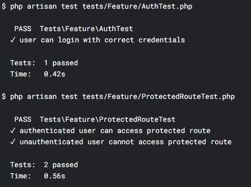

---

## **Установка и запуск**

### Манифесты для сборки docker образов

Файл `Dockerfile`:
```dockerfile
FROM php:8.1-apache
WORKDIR /var/www/html
RUN apt-get update && apt-get install -y \
    git zip unzip libpng-dev libonig-dev libxml2-dev \
    && docker-php-ext-install pdo pdo_mysql mbstring gd \
    && curl -sS https://getcomposer.org/installer | php -- --install-dir=/usr/local/bin --filename=composer
COPY . .
RUN composer install --no-dev --optimize-autoloader \
    && chown -R www-data:www-data storage bootstrap/cache \
    && php artisan key:generate --force \
    && a2enmod rewrite \
    && cp docker/000-default.conf /etc/apache2/sites-available/
EXPOSE 80
CMD ["apache2-foreground"]
```

---

## **Лицензия**

Этот проект лицензирован по лицензии MIT – подробности в файле [LICENSE.md](LICENSE.md)

---

## **Контакты**

Автор: alexbobrik00@gmail.com
